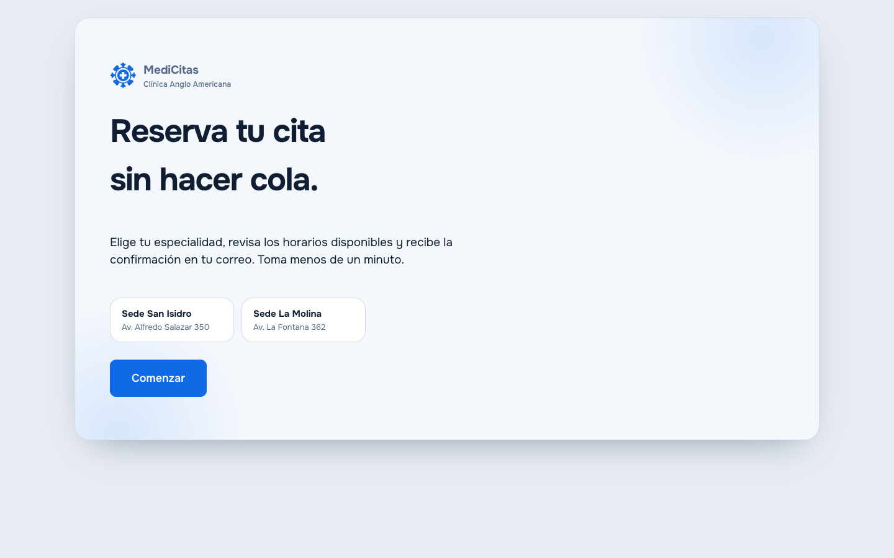
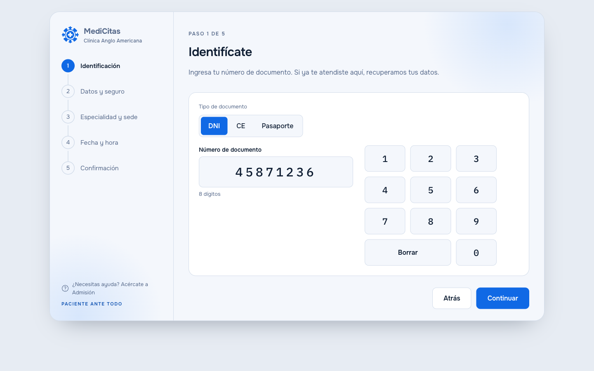
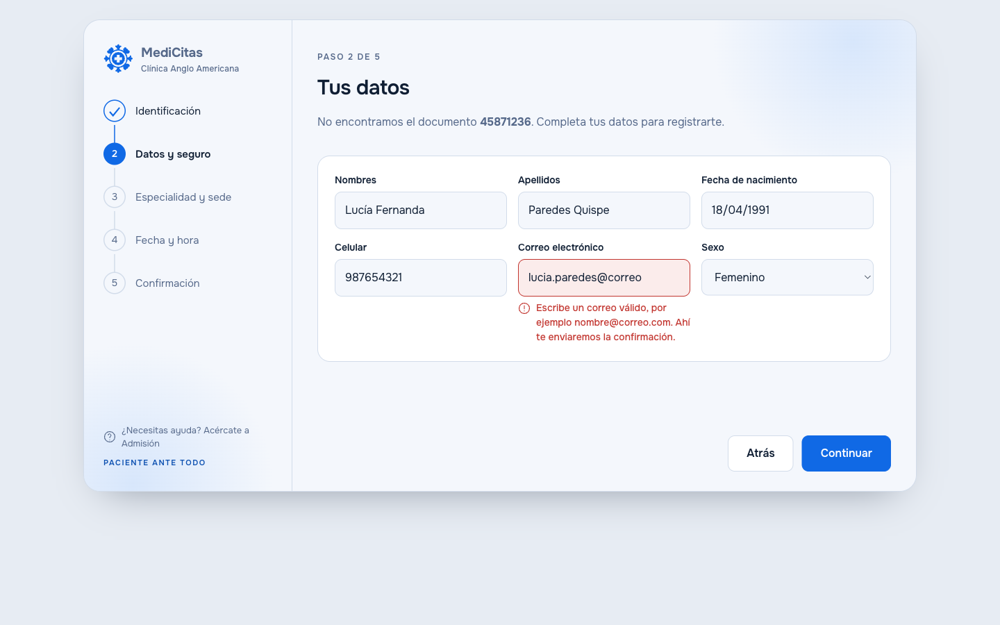
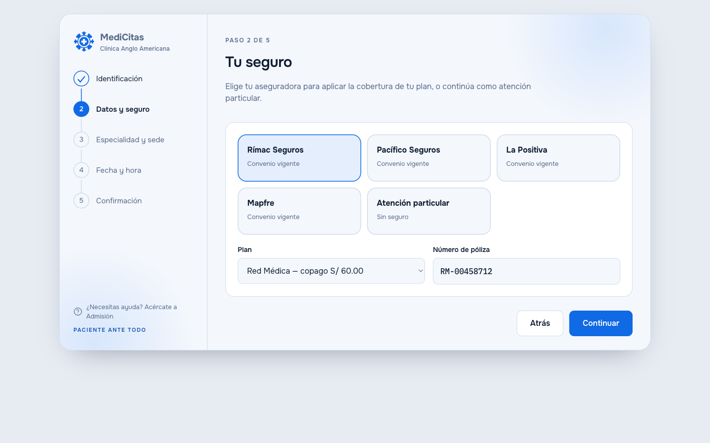
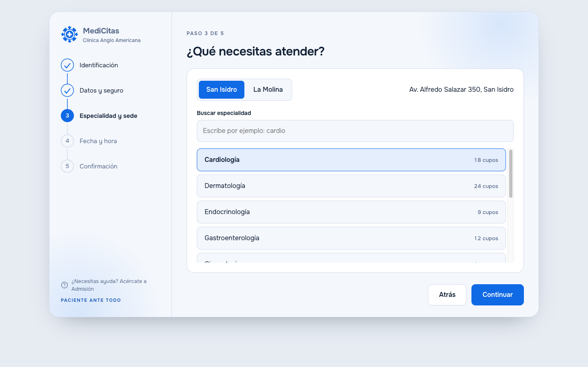
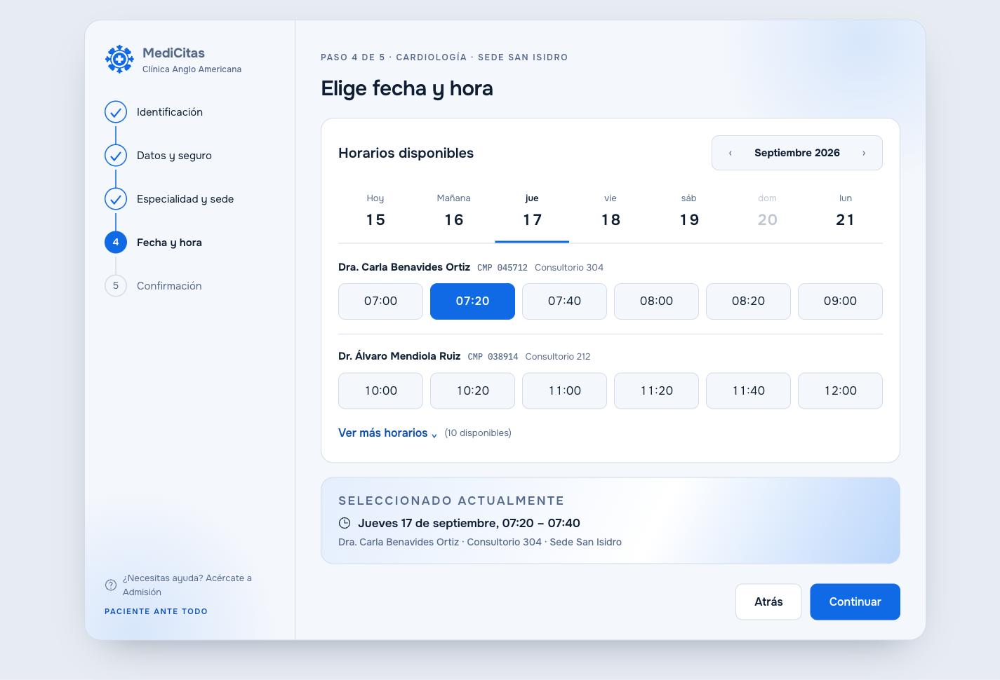
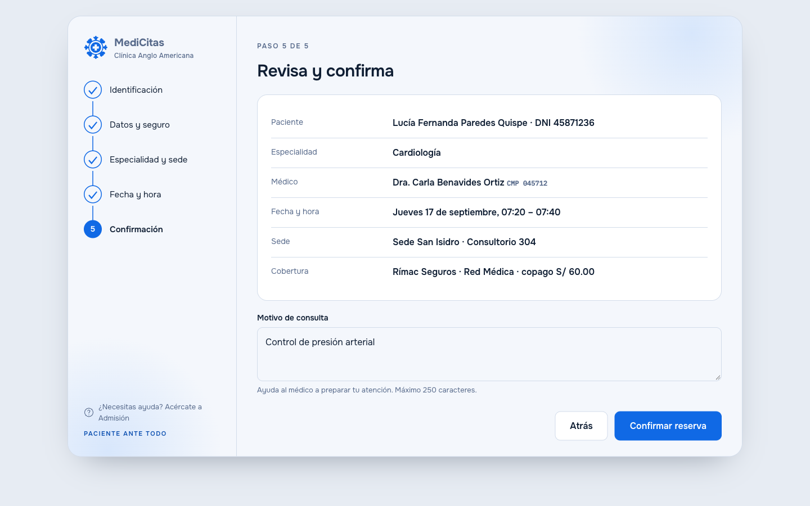
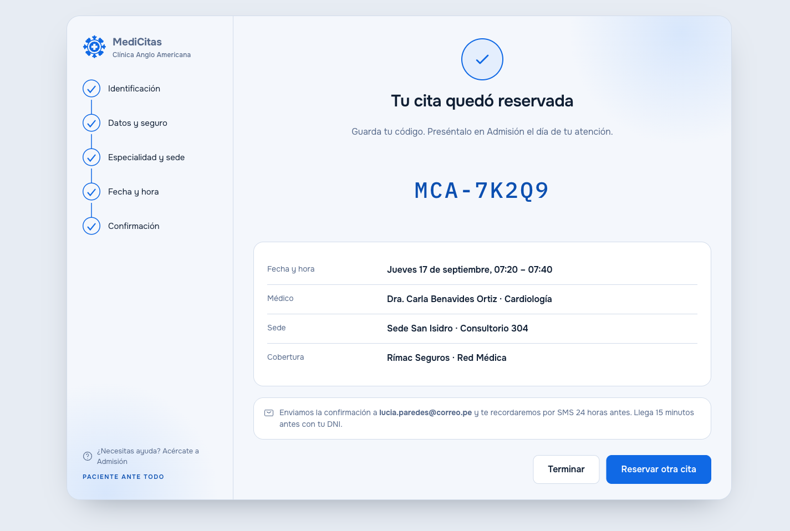

# Prototipo visual - Flujo de reserva de cita

Prototipo navegable del **flujo completo de reserva** en el Kiosko de autoatención, de la bienvenida hasta la cita confirmada. Un solo archivo HTML, sin instalación ni servidor.

Sigue la librería de componentes elegida por el equipo, **AtlantaFX** (controles planos, bordes de 1 px, anillos de foco), con el estilo de asistente por pasos acordado para la presentación.

## Cómo abrirlo

1. Abre `docs/prototype/index.html` en Chrome, Edge o Firefox.
2. Usa la barra superior para moverte: lista de pantallas, flechas anterior/siguiente y botón de tema claro/oscuro.
3. Cada pantalla tiene su enlace propio (`index.html#fecha`), útil para saltar directo durante la exposición.

## Pantallas del flujo

| Ruta | Pantalla | Cubre |
|---|---|---|
| `#bienvenida` | Bienvenida / espera | — |
| `#identificacion` | 1 · Identificación con teclado en pantalla | RF-02 |
| `#datos` | 2 · Registro del paciente, con ejemplo de error de validación | RF-01, RNF-06 |
| `#seguro` | 2b · Aseguradora, plan y póliza, o atención particular | RF-03 |
| `#especialidad` | 3 · Especialidad y sede | RF-04 |
| `#fecha` | 4 · Fecha y hora, por médico y consultorio | RF-05 |
| `#confirmacion` | 5 · Revisión y motivo de consulta | RF-06 |
| `#listo` | 6 · Cita reservada, con código y avisos | RF-11, RF-12 |

## Cómo se ven

Capturas del prototipo a 1440 × 900 px, sin la barra de navegación del propio prototipo. Las pantallas equivalentes ya construidas en JavaFX están en [`docs/screens.md`](../screens.md).

### Bienvenida

### 1 · Identificación

### 2 · Datos del paciente

Incluye el ejemplo de error de validación en el correo electrónico.

### 2b · Aseguradora y plan

### 3 · Especialidad y sede

### 4 · Fecha y hora

### 5 · Revisar y confirmar

### 6 · Cita reservada

## Qué se puede probar

- Elegir día en la franja de fechas y horario en la cuadrícula: el resumen "Seleccionado actualmente" se actualiza solo.
- "Ver más horarios" despliega la agenda de la tarde de un tercer médico.
- El teclado en pantalla escribe y borra el número de documento.
- Cambiar de sede actualiza la dirección; las tarjetas de aseguradora y la lista de especialidades son de selección única.
- "Confirmar reserva" muestra el estado de carga antes de pasar a la cita confirmada.
- El domingo aparece deshabilitado, porque no hay atención.

Los datos (pacientes, médicos, CMP, códigos) son ficticios y coinciden con los ejemplos del contrato de la API.

## Accesibilidad

Etiquetas reales en cada campo, errores anunciados con `role="alert"`, foco visible, objetivos táctiles de 52 px o más, contraste verificado en ambos temas y respeto por `prefers-reduced-motion`.

## Tokens de diseño compartidos con JavaFX

El cliente de escritorio usa exactamente estos valores, para que las pantallas funcionales se vean igual que el prototipo. La última columna indica la variable de AtlantaFX (*looked-up color*) que conviene sobrescribir en el CSS del tema.

| Token | Claro | Oscuro | Uso | AtlantaFX |
|---|---|---|---|---|
| `ground` | `#E7ECF3` | `#0A1220` | Fondo detrás de la tarjeta | `-color-bg-inset` |
| `surface` | `#F4F7FC` | `#111C2E` | Tarjeta del asistente | `-color-bg-default` |
| `surface-2` | `#FFFFFF` | `#16243A` | Campos, chips de horario, filas | `-color-bg-subtle` |
| `ink` | `#0F1E33` | `#E6EDF7` | Texto principal | `-color-fg-default` |
| `muted` | `#56698A` | `#94A6BF` | Texto secundario | `-color-fg-muted` |
| `line` | `#D2DCEA` | `#24344E` | Bordes y divisores | `-color-border-default` |
| `accent` | `#1069E5` | `#4D93FF` | Marca, paso activo, horario elegido | `-color-accent-emphasis` |
| `accent-strong` | `#0B4FB0` | `#8BB8FF` | Enlaces y estados hover | `-color-accent-fg` |
| `accent-soft` | `#E4EEFD` | `#16294A` | Relleno de selección | `-color-accent-subtle` |
| `glow` | `#BBD6FB` | `#1D3A66` | Degradados de fondo | `-color-accent-muted` |
| `danger` | `#C2352F` | `#E98D87` | Errores de validación | `-color-danger-emphasis` |

El color `#1069E5` y el emblema provienen del logotipo oficial de la Clínica Anglo Americana. Los iconos son de [Iconoir](https://iconoir.com) (licencia MIT).

**Tipografías:** Onest para la interfaz; IBM Plex Mono para códigos de cita, CMP y póliza. Ambas con licencia SIL OFL.
