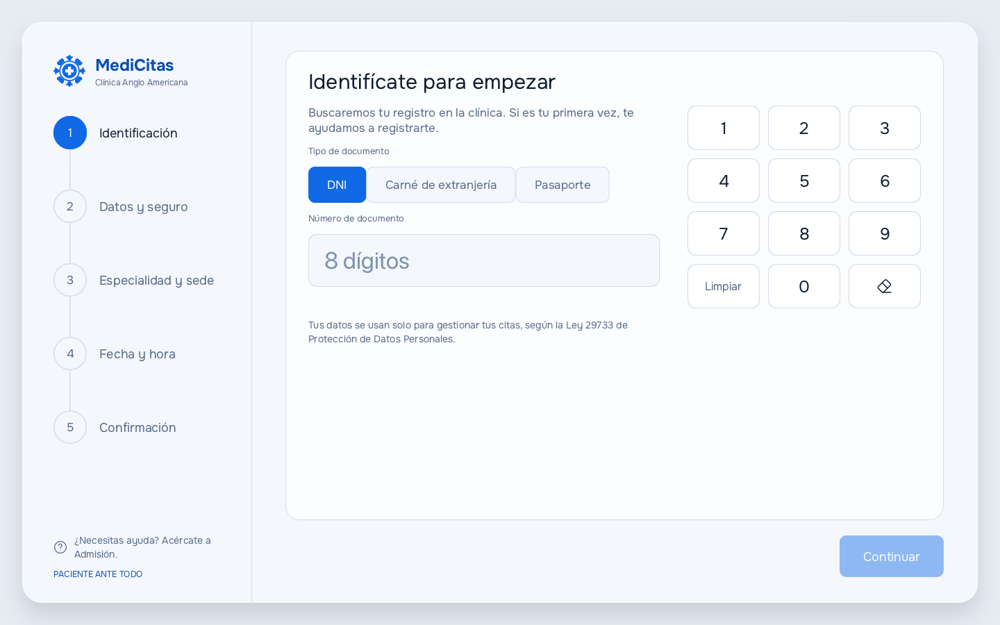
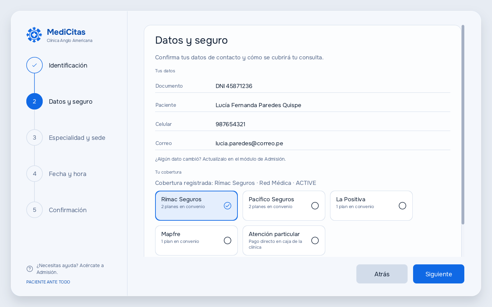
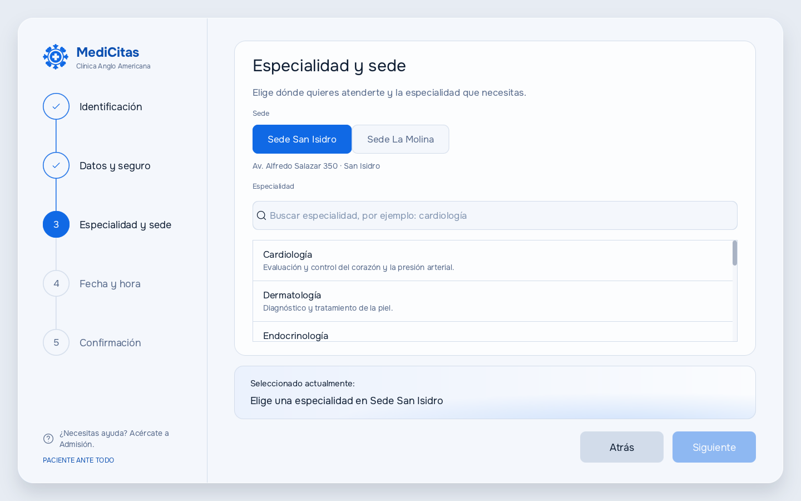
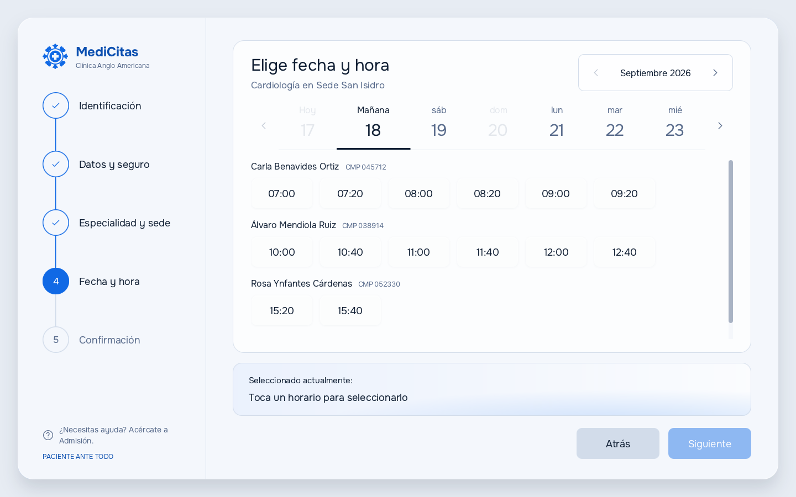
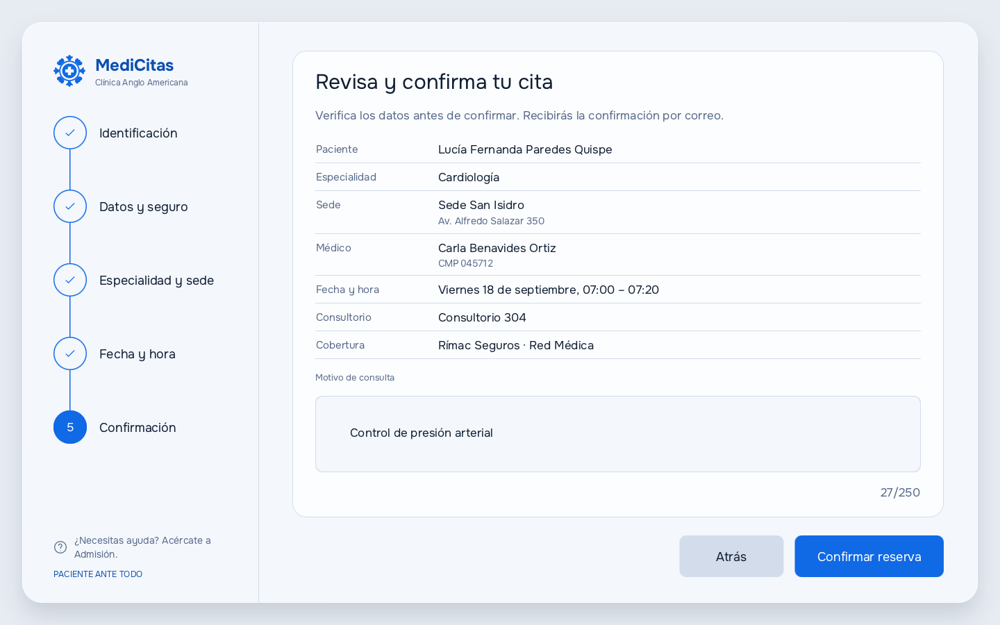
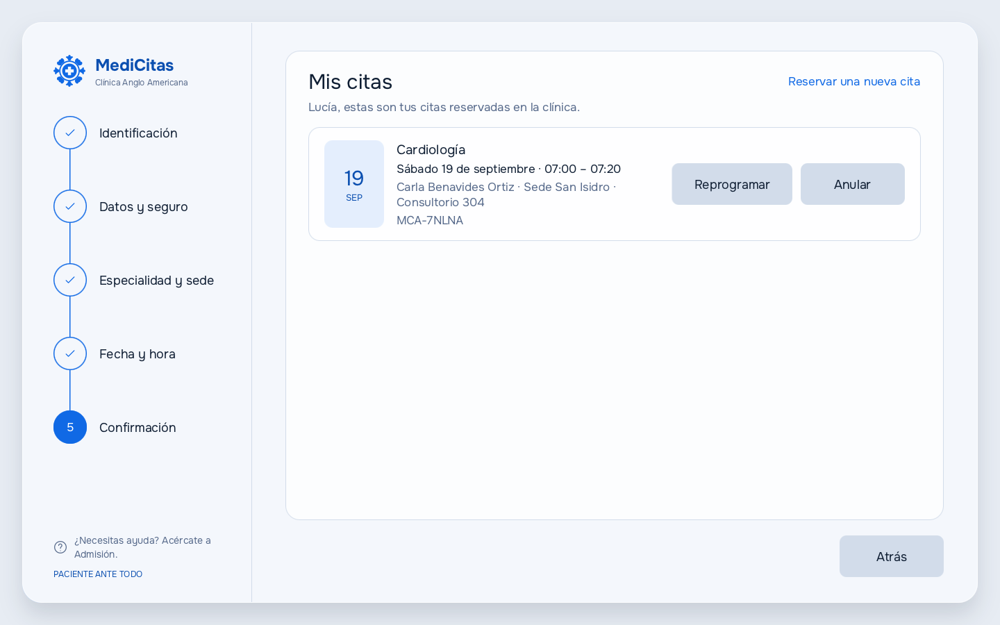

# Pantallas de la aplicación de escritorio

Capturas reales del cliente JavaFX (`/desktop`) corriendo el flujo completo de reserva. Cada imagen sale de la propia aplicación, no de un diseño: son las pantallas que ve el paciente.

Las capturas se tomaron con la API simulada (`--demo-stub`), con el paciente de prueba **Lucía Fernanda Paredes Quispe** (DNI 45871236), a 1440 × 900 px.

Para ver el diseño navegable e interactivo del mismo flujo, revisa el [prototipo visual](prototype/README.md).

## 1 · Identificación

El paciente ingresa su documento con el teclado en pantalla. Si ya se atendió antes, el sistema recupera su perfil; si no, pasa al registro.

**Cubre:** RF-01 (registro de paciente), RF-02 (identificación del paciente).



## 2 · Datos y seguro

Confirma sus datos de contacto y elige la aseguradora con convenio (Rímac, Pacífico, La Positiva, Mapfre) con su plan y póliza, o continúa como atención particular.

**Cubre:** RF-01 (registro de paciente), RF-03 (asociación de aseguradora).



## 3 · Especialidad y sede

Elige entre las sedes San Isidro y La Molina, y busca la especialidad. El listado viene de las especialidades activas que expone la API.

**Cubre:** RF-04 (consulta de especialidades disponibles).



## 4 · Fecha y hora

Muestra los cupos libres agrupados por médico y consultorio, para el día elegido en la franja de fechas. Los días sin atención aparecen deshabilitados.

**Cubre:** RF-05 (consulta de disponibilidad de citas).



## 5 · Confirmación

Resumen completo antes de reservar: paciente, especialidad, sede, médico, fecha, consultorio, cobertura y motivo de consulta.

**Cubre:** RF-06 (reserva de cita), RF-07 (bloqueo de cupos concurrentes), RF-08 (prevención de citas duplicadas), RF-11 (confirmación automática).



## 6 · Mis citas

Lista las citas reservadas del paciente con su código, y permite reprogramarlas o anularlas.

**Cubre:** RF-09 (reprogramación), RF-10 (anulación).



## Cómo regenerar estas capturas

El recorrido y las capturas están automatizados en `com.medicitas.kiosk.dev.DemoCapture`, así que las imágenes se rehacen con un solo comando desde la raíz del repositorio:

```bash
./scripts/run-kiosk.sh --demo-stub --capture=docs/screens/img/
```

La aplicación recorre las seis pantallas con datos de demostración, guarda un PNG por cada una en `docs/screens/img/` y se cierra sola. Los nombres de archivo los define `DemoCapture`, de modo que los enlaces de este documento siguen funcionando sin tocar nada.

> Al cerrarse, JavaFX imprime un `IllegalStateException: Not on FX application thread` proveniente del cierre de la ventana. Es inofensivo y ocurre después de guardar todas las capturas.
